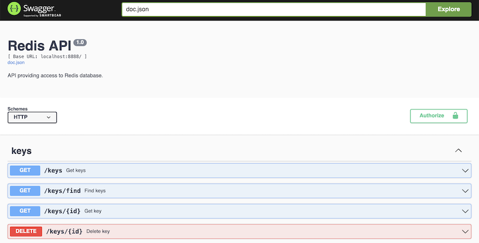

# Go Redis REST API

Rest API for interacting with the Redis database.

## Installation

```shell
go get github.com/darkorsa/go-redis-rest-api
```

## Usage

Copy and rename `.env_example` to `.env`.

Fill `.env` file with settings matching you environment configuration.

Run:
```shell
go run main.go
```

The API endpoints documentation is generated using Swagger and available at url: `{your-server-address}/apidocs/index.html`



Note that API endpoints require authorization with `JWT token`.

Token can be obtained at `/token` endpoint.
